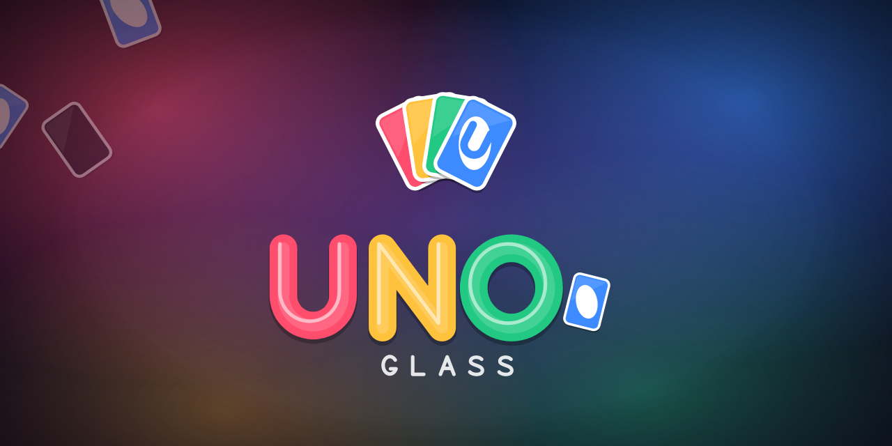

# UNO Glass — Brand guidelines



## Essence

**Frosted glass, four bright cards, deep night backgrounds.**
UNO Glass is the classic card game made calm, premium and modern. It should feel
playful but polished, like a glass ornament in candy colors.

- **Personality:** friendly, bright, a little cheeky ("Stack it or take +4"), never shouty.
- **Visual pillars:** frosted glass panels · four-color card fan · soft glow on deep night · rounded everything.
- **Voice:** short, warm, second person ("Your turn", "Dealing you in…"). Use exclamation marks for real moments only: UNO!, wins, level ups.

## Logo

| Asset | File | Use |
|---|---|---|
| Emblem (app icon) | `svg/emblem.svg` · `png/icon-*.png` · `icon.ico` | Icons, avatars, favicons, small spaces |
| Emblem, transparent | `svg/emblem-transparent.svg` | Over artwork and backgrounds |
| Wordmark | `svg/wordmark.svg` | Dark backgrounds (default) |
| Wordmark, light bg | `svg/wordmark-light.svg` | White or light backgrounds |
| Wordmark, mono | `svg/wordmark-white.svg` · `svg/wordmark-dark.svg` | One-color print, watermarks |
| Horizontal lockup | `svg/lockup-horizontal(-light).svg` | Headers, banners, README |
| Stacked lockup | `svg/lockup-stacked(-light).svg` | Posters, square spaces |

**The emblem** is four cards fanned like a hand you're about to play. They run in deck
order (Ruby, Amber, Jade, Azure), with the Azure card in front showing the "U" monogram,
all in a frosted night tile.

**The wordmark** spells "UNO" in glossy glass-tube letters, one color per card, and ends
with a small Azure card that works as its full stop. "GLASS" sits underneath in a
monoline, widely letter-spaced face.

- **Clear space:** keep at least the height of the Azure card dot clear on every side.
- **Minimum sizes:**
  - Wordmark: 120 px wide on screen.
  - Emblem: 16 px. It's tuned to stay readable as a favicon.
- **Don'ts:**
  - Don't recolor the letters or change their order.
  - Don't stretch, skew, or add outlines or drop shadows beyond the built-in ones.
  - Don't place the full-color wordmark on busy, mid-tone photos. Use the mono version.
  - Don't set "UNO Glass" in a regular font as a substitute for the logo.

## Color

| Name | Hex | RGB | Role |
|---|---|---|---|
| **Ruby** | `#FF4D6D` | 255 77 109 | Red cards, alerts, energy |
| **Amber** | `#FFC23D` | 255 194 61 | Yellow cards, highlights, UNO calls |
| **Jade** | `#22C983` | 34 201 131 | Green cards, success |
| **Azure** | `#3D8BFF` | 61 139 255 | Blue cards, links |
| **Violet** | `#8B6CFF` | 139 108 255 | Primary accent: buttons, XP, focus |
| **Midnight** | `#0B0D22` | 11 13 34 | Base background |
| **Indigo** | `#2A1B5E` | 42 27 94 | Background gradients, icon tile |
| **Night** | `#161624` | 22 22 36 | Card backs, wild cards |
| **Frost** | `#FFFFFF` @ 6–30% | — | Glass fills, rims, secondary text |

- **Background:** a vertical gradient from `#090A1A` to `#170B29`, with soft radial glows of Ruby (top left), Azure (top right), Jade (bottom right) and Amber (bottom left), plus a vignette.
- **Text:** white at 95% for primary text and 58% for secondary. Never pure black on dark.
- **Danger:** `#FF5A7A`. Use it for destructive buttons and errors only.

## Typography

- **UI:** Inter, falling back to Segoe UI Variable, Segoe UI, SF Pro, Helvetica Neue, Roboto, Arial.
- **Weights:**
  - Titles 800.
  - Buttons and labels 600–700.
  - Body 500.
  - Section labels 700, all caps, 12 px, muted.
- **Big moments:** SKIP, +4, UNO! and YOUR TURN use weight 900, with a soft dark outline.

## Glass recipe

| Property | Value |
|---|---|
| Fill | Background blur, plus white at 6–12% |
| Rim | White 1.5 px at about 30%, brighter at the top and fading toward the bottom |
| Shadow | Black 25–32%, 10 px offset down, about 26 px soft |
| Corners | 22–28 px for panels, 12–14 px for buttons, 13 px for cards |
| Highlight | Optional colored outer glow (active player = current card color) |
| Sheen | A faint diagonal light band, max 5% |

The in-game implementation is `client/shaders/glass.gdshader`, and the logo shine is
`client/shaders/shimmer.gdshader`.

## Motion

- **Easing:** cubic ease-out for movement (0.2–0.35 s), and back ease-out for pops (banners, pills).
- **Cards:** cards fly, they don't teleport. Playable cards float up 14 px on your turn.
- **Shine:** the logo shimmer sweeps every few seconds. It shouldn't run constantly.
- **Reduce motion:** respect the setting by turning off shake, confetti and drifting cards.

## Sound

The sounds are soft synth and sine bells: short, rounded, never harsh. There's a gentle chime for your
turn, a bright arpeggio for UNO, a fanfare for wins, and lo-fi music in the menus with upbeat synth-pop in game.
Every sound comes from `tools/gen_audio.py`.

## Marketing assets

| File | Size | Where |
|---|---|---|
| `png/social-preview-1280x640.png` | 1280×640 | GitHub social preview, link cards |
| `png/key-art-1920x1080.png` | 1920×1080 | Store hero, wallpaper, trailer end card |
| `png/capsule-630x500.png` | 630×500 | itch.io cover |
| `png/capsule-460x215.png` | 460×215 | Steam-style header capsule |
| `png/splash-1600x900.png` | 1600×900 | Boot splash (also `client/branding/splash.png`) |
| `svg/brand-board.svg` | 1800×1200 | One-page brand overview (open in a browser) |

## Regenerating

Everything comes from one script, so a change to a color or shape updates every asset:

```powershell
python tools/gen_branding.py                                   # SVGs (+ game copies)
godot --headless --script tools/render_branding.gd -- .        # PNG renders
python tools/gen_branding.py --ico                             # Windows icon
```

## A note on the name

"UNO" is a registered trademark of Mattel. "UNO Glass" is fine as a working name for a
private, non-commercial closed beta. Before any public or commercial release, rename the
game and keep this visual system.

The emblem, palette, glass style and motion don't depend on the name. Only the
wordmark letters do, and they're generated in `tools/gen_branding.py`.
